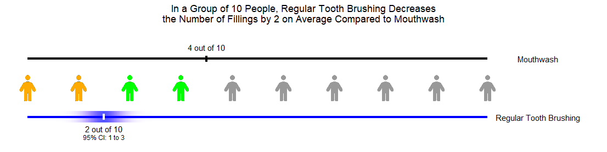

[](https://doi.org/10.5281/zenodo.15424132)

# PopViz

A visualisation package to show absolute effects as a proportion of a population.

## Installation

From your R console, use the following command

```         
# install.packages("remotes") # If not already installed
remotes::install_github("CRSU-Apps/PopViz")
```

If you encounter issues with {ggplot2} functions not being found, or with files not being found, try restarting your R session.

## Examples

### Using Defaults



```         
PopViz::PopViz(
  glyph_count = 10,
  event_desired = FALSE,
  outcome_name = "Fillings",
  reference_name = "Mouthwash",
  treatment_name = "Regular Tooth Brushing",
  outcome_type = "RD",
  reference_probability = 0.4,
  relative_effect = -0.2,
  relative_confidence_interval = c(-0.26, -0.14)
)
```

### Using Additional Options


```         
PopViz::PopViz(
  glyph_count = 20,
  person_multiplier = 5,
  event_desired = FALSE,
  outcome_name = "Blisters",
  reference_name = "Trainers",
  treatment_name = "High Heels",
  outcome_type = "RD",
  reference_probability = 0.04,
  relative_effect = 0.37,
  colour_palette = "colourblind",
  glyph = "person-dress",
  relative_confidence_interval = c(0.3, 0.4),
  population_name = "Women",
  treatment_plural = TRUE
)
```
